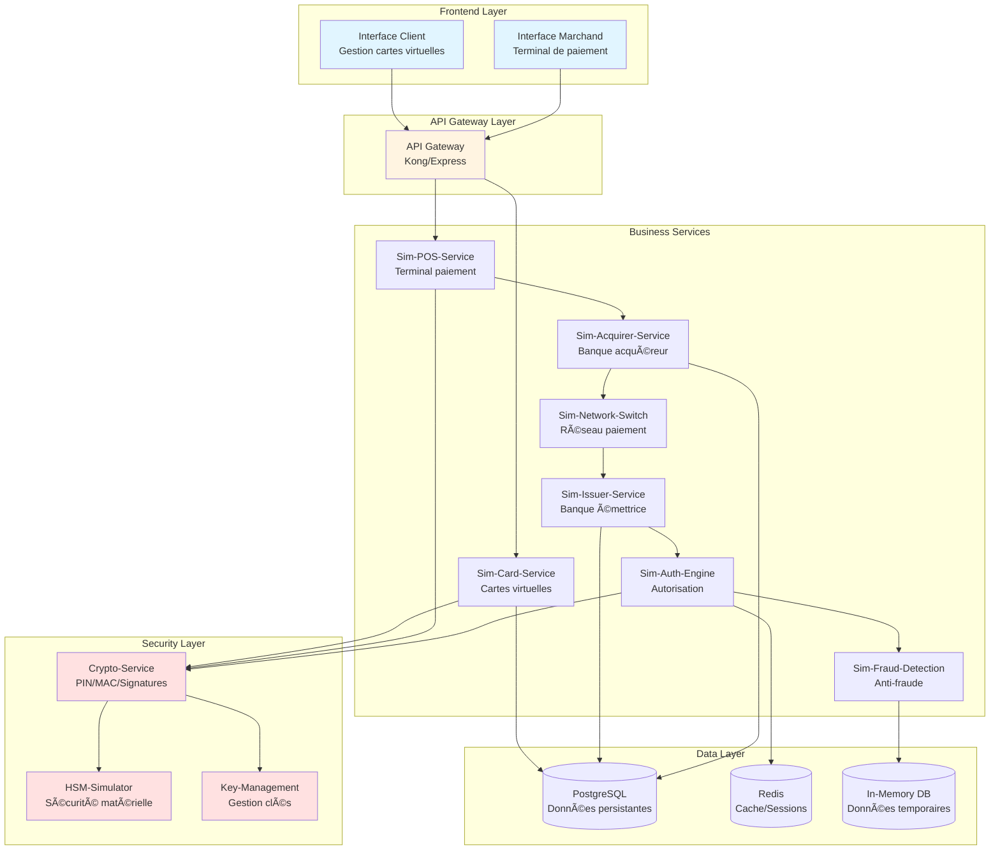
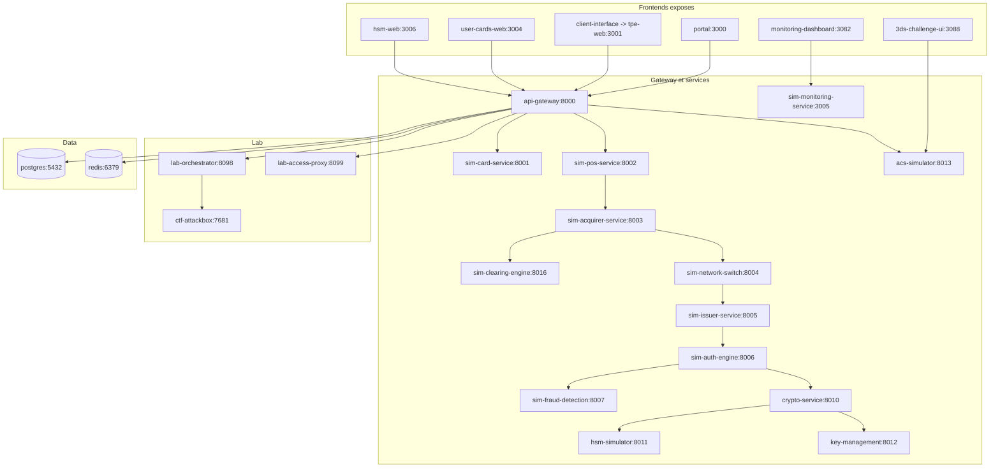
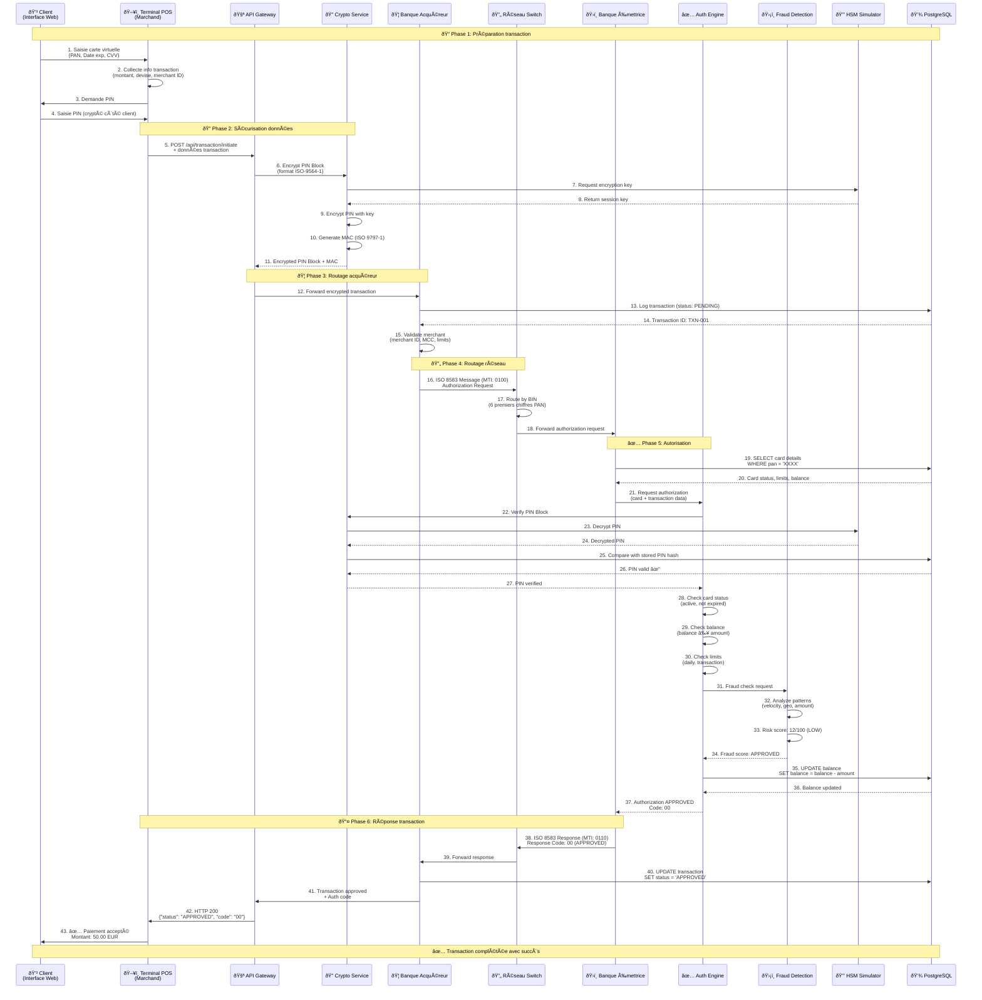
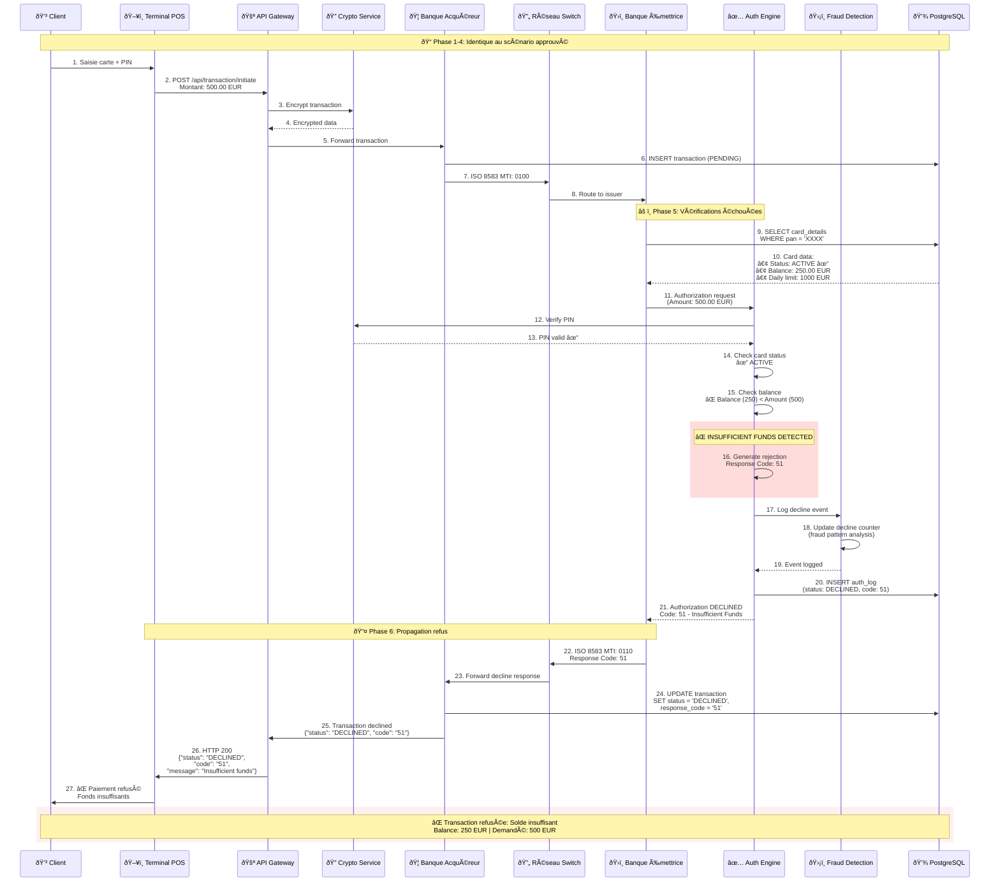

# 🏦 Plateforme Monétique Pédagogique (PMP)

<div align="center">

[](https://opensource.org/licenses/MIT)
[](https://www.docker.com/)
[](https://github.com/philbalog13/PMP)
[](https://github.com/philbalog13/PMP)
[](https://github.com/philbalog13/PMP)

**Un écosystème bancaire 100% logiciel conçu pour l'apprentissage profond des flux de transactions et de la sécurité cryptographique.**

</div>

---

## 🚀 État de la Plateforme (Dernière Vérification)

| Composant | Statut | Détails |
| :--- | :--- | :--- |
| **Logic Platform** | ✅ Opérationnel | 73 tests E2E réussis sur 77 (95%) |
| **Backend Core** | ✅ Launché | 9 services microservices synchronisés |
| **Infrastructure** | ✅ Sain | PostgreSQL & Redis configurés avec Health Checks |
| **API Gateway** | ✅ Réparé | Circuit Breaker & JWT Validés |
| **Sécurité (HSM)** | ✅ Actif | Simulateur HSM intégré et fonctionnel |
| **Interface Client** | ✅ Complète | 6 pages avec Dark Neon Glassmorphism |
| **Interface Marchand** | ✅ Complète | Terminal NEO avec mode simulation |
| **Interface HSM** | ✅ Complète | Dashboard, Keys, Vulnerabilities |

---

## 📋 Table des matières

- [Vue d'ensemble](#-vue-densemble)
- [Architecture générale](#-architecture-générale)
- [Applications Frontend](#-applications-frontend)
- [Connexion Frontend-Backend](docs/FRONTEND_BACKEND_CONNECTION.md)
- [Diagrammes](#-diagrammes)
  - [Déploiement Docker Compose](#1-diagramme-de-déploiement-docker-compose)
  - [Transaction approuvée](#2-diagramme-de-séquence---transaction-approuvée)
  - [Transaction refusée](#3-diagramme-de-séquence---transaction-refusée-code-51)
- [Spécifications techniques](#-spécifications-techniques-des-services)
- [Stack technologique](#-stack-technologique)
- [Sécurité pédagogique](#-sécurité-pédagogique)

---

## 🎯 Vue d'ensemble

La Plateforme Monétique Pédagogique (PMP) est un système éducatif permettant de comprendre le fonctionnement complet d'une transaction par carte bancaire, de l'initiation au paiement jusqu'à l'autorisation finale.

### Objectifs pédagogiques

- ✅ Simuler l'écosystème complet d'une transaction carte
- ✅ Illustrer les rôles de chaque acteur (banque émettrice, acquéreur, réseau)
- ✅ Démontrer les mécanismes de sécurité (cryptographie, HSM, détection fraude)
- ✅ Expérimenter différents scénarios (approuvé, refusé, fraude)

---

## 🎨 Applications Frontend

Toutes les interfaces utilisent le **Dark Neon Glassmorphism** design system.

| Application | Port | Description |
|-------------|------|-------------|
| **portal** | 3000 | Hub central multi-rôles (Client, Merchant, Student, Trainer) |
| **tpe-web** | 3001 | Terminal de paiement marchand |
| **user-cards-web** | 3004 | Interface client (cartes, transactions, stats) |
| **hsm-web** | 3006 | Simulateur HSM (clés, vulnérabilités) |
| **3ds-challenge-ui** | 3088 | Page OTP 3D Secure |
| **monitoring-dashboard** | 3082 | Dashboard de supervision temps réel |

Runtime source of truth:
- CLI officiel: `node scripts/runtime-stack.mjs`
- Compose officiel: `docker-compose-runtime.yml`
- Nom de service runtime a connaitre: `client-interface` expose en realite l'application `frontend/tpe-web` sur `http://localhost:3001`

### 3DS Challenge UI (OTP)

- URL : `http://localhost:3088/?txId=TX_123&acsTransId=ACS_123&returnUrl=http%3A%2F%2Flocalhost%3A3001%2F`
- OTP pédagogique : `123456`
- Redirection : après succès, redirige vers `returnUrl` avec `transStatus=Y`, `txId`, `acsTransId`

### Design System

```
┌─────────────────────────────────────┐
│     Dark Neon Glassmorphism         │
├─────────────────────────────────────┤
│  Background:  #020617 (Slate 950)   │
│  Glass:       rgba(15,23,42,0.7)    │
│  Primary:     #3b82f6 (Blue 500)    │
│  Secondary:   #a855f7 (Purple 500)  │
│  Fonts:       Outfit + Inter        │
└─────────────────────────────────────┘
```

📖 **[Guide de connexion Frontend-Backend](docs/FRONTEND_BACKEND_CONNECTION.md)**

---


```mermaid
graph TB
    subgraph "Frontend Layer"
        CLIENT[Interface Client<br/>Gestion cartes virtuelles]
        MERCHANT[Interface Marchand<br/>Terminal de paiement]
    end

    subgraph "API Gateway Layer"
        GATEWAY[API Gateway<br/>Kong/Express]
    end

    subgraph "Business Services"
        CARD[Sim-Card-Service<br/>Cartes virtuelles]
        POS[Sim-POS-Service<br/>Terminal paiement]
        ACQUIRER[Sim-Acquirer-Service<br/>Banque acquéreur]
        SWITCH[Sim-Network-Switch<br/>Réseau paiement]
        ISSUER[Sim-Issuer-Service<br/>Banque émettrice]
        AUTH[Sim-Auth-Engine<br/>Autorisation]
        FRAUD[Sim-Fraud-Detection<br/>Anti-fraude]
    end

    subgraph "Security Layer"
        CRYPTO[Crypto-Service<br/>PIN/MAC/Signatures]
        HSM[HSM-Simulator<br/>Sécurité matérielle]
        KEYS[Key-Management<br/>Gestion clés]
    end

    subgraph "Data Layer"
        POSTGRES[(PostgreSQL<br/>Données persistantes)]
        REDIS[(Redis<br/>Cache/Sessions)]
        MEMORY[(In-Memory DB<br/>Données temporaires)]
    end

    CLIENT --> GATEWAY
    MERCHANT --> GATEWAY
    GATEWAY --> CARD
    GATEWAY --> POS
    
    POS --> ACQUIRER
    ACQUIRER --> SWITCH
    SWITCH --> ISSUER
    ISSUER --> AUTH
    AUTH --> FRAUD
    
    CARD --> CRYPTO
    POS --> CRYPTO
    AUTH --> CRYPTO
    
    CRYPTO --> HSM
    CRYPTO --> KEYS
    
    CARD --> POSTGRES
    ISSUER --> POSTGRES
    ACQUIRER --> POSTGRES
    AUTH --> REDIS
    FRAUD --> MEMORY

    style CLIENT fill:#e1f5ff
    style MERCHANT fill:#e1f5ff
    style GATEWAY fill:#fff4e1
    style CRYPTO fill:#ffe1e1
    style HSM fill:#ffe1e1
    style KEYS fill:#ffe1e1
```

---

## 📊 Diagrammes

### 1. Diagramme de déploiement Docker Compose

La verite runtime n'est plus le schema historique ci-dessous mais:
- `docker-compose-runtime.yml` pour la liste exacte des services
- `node scripts/runtime-stack.mjs` pour le bootstrap officiel

Le runtime courant expose 29 services, dont:
- 6 frontends: `portal`, `client-interface` (`tpe-web`), `user-cards-web`, `hsm-web`, `3ds-challenge-ui`, `monitoring-dashboard`
- 14 services coeur/securite: `api-gateway`, `sim-*`, `crypto-service`, `hsm-simulator`, `key-management`, `acs-simulator`
- 3 services lab: `lab-orchestrator`, `lab-access-proxy`, `ctf-attackbox`
- 6 services infra: `postgres`, `redis`, `pgadmin`, `docker-socket-proxy`, `nginx`, `certbot-renew`


```mermaid
graph TB
    subgraph "Frontends exposes"
        PORTAL[portal:3000]
        TPE[client-interface -> tpe-web:3001]
        CARDS[user-cards-web:3004]
        HSMW[hsm-web:3006]
        THREEDS[3ds-challenge-ui:3088]
        MONUI[monitoring-dashboard:3082]
    end

    subgraph "Gateway et services"
        GW[api-gateway:8000]
        CARD[sim-card-service:8001]
        POS[sim-pos-service:8002]
        ACQ[sim-acquirer-service:8003]
        CLR[sim-clearing-engine:8016]
        SWT[sim-network-switch:8004]
        ISS[sim-issuer-service:8005]
        AUTH[sim-auth-engine:8006]
        FRAUD[sim-fraud-detection:8007]
        MONSVC[sim-monitoring-service:3005]
        CRYPTO[crypto-service:8010]
        HSM[hsm-simulator:8011]
        KM[key-management:8012]
        ACS[acs-simulator:8013]
    end

    subgraph "Lab"
        LABO[lab-orchestrator:8098]
        LABP[lab-access-proxy:8099]
        CTF[ctf-attackbox:7681]
    end

    subgraph "Data"
        DB[(postgres:5432)]
        REDIS[(redis:6379)]
    end

    PORTAL --> GW
    TPE --> GW
    CARDS --> GW
    HSMW --> GW
    THREEDS --> ACS
    MONUI --> MONSVC
    GW --> CARD
    GW --> POS
    GW --> LABO
    GW --> LABP
    POS --> ACQ
    ACQ --> CLR
    ACQ --> SWT
    SWT --> ISS
    ISS --> AUTH
    AUTH --> FRAUD
    AUTH --> CRYPTO
    CRYPTO --> HSM
    CRYPTO --> KM
    GW --> ACS
    GW --> DB
    GW --> REDIS
    LABO --> CTF
```

Pour les ports exposes et les noms de conteneurs reellement utilises, se referer a:
- `docker compose -f docker-compose-runtime.yml config --services`
- `docker-compose-runtime.yml`

---

### 2. Diagramme de séquence - Transaction approuvée


```mermaid
sequenceDiagram
    participant Client as 💳 Client<br/>(Interface Web)
    participant POS as 🖥️ Terminal POS<br/>(Marchand)
    participant Gateway as 🚪 API Gateway
    participant Crypto as 🔐 Crypto Service
    participant Acquirer as 🏦 Banque Acquéreur
    participant Switch as 🔄 Réseau Switch
    participant Issuer as 🏛️ Banque Émettrice
    participant Auth as ✅ Auth Engine
    participant Fraud as 🛡️ Fraud Detection
    participant HSM as 🔒 HSM Simulator
    participant DB as 💾 PostgreSQL

    Note over Client,DB: 📝 Phase 1: Préparation transaction
    
    Client->>POS: 1. Saisie carte virtuelle<br/>(PAN, Date exp, CVV)
    POS->>POS: 2. Collecte info transaction<br/>(montant, devise, merchant ID)
    POS->>Client: 3. Demande PIN
    Client->>POS: 4. Saisie PIN (crypté côté client)
    
    Note over POS,Crypto: 🔐 Phase 2: Sécurisation données
    
    POS->>Gateway: 5. POST /api/transaction/initiate<br/>+ données transaction
    Gateway->>Crypto: 6. Encrypt PIN Block<br/>(format ISO-9564-1)
    Crypto->>HSM: 7. Request encryption key
    HSM-->>Crypto: 8. Return session key
    Crypto->>Crypto: 9. Encrypt PIN with key
    Crypto->>Crypto: 10. Generate MAC (ISO 9797-1)
    Crypto-->>Gateway: 11. Encrypted PIN Block + MAC
    
    Note over Gateway,Acquirer: 🏦 Phase 3: Routage acquéreur
    
    Gateway->>Acquirer: 12. Forward encrypted transaction
    Acquirer->>DB: 13. Log transaction (status: PENDING)
    DB-->>Acquirer: 14. Transaction ID: TXN-001
    Acquirer->>Acquirer: 15. Validate merchant<br/>(merchant ID, MCC, limits)
    
    Note over Acquirer,Switch: 🔄 Phase 4: Routage réseau
    
    Acquirer->>Switch: 16. ISO 8583 Message (MTI: 0100)<br/>Authorization Request
    Switch->>Switch: 17. Route by BIN<br/>(6 premiers chiffres PAN)
    Switch->>Issuer: 18. Forward authorization request
    
    Note over Issuer,Auth: ✅ Phase 5: Autorisation
    
    Issuer->>DB: 19. SELECT card details<br/>WHERE pan = 'XXXX'
    DB-->>Issuer: 20. Card status, limits, balance
    Issuer->>Auth: 21. Request authorization<br/>(card + transaction data)
    
    Auth->>Crypto: 22. Verify PIN Block
    Crypto->>HSM: 23. Decrypt PIN
    HSM-->>Crypto: 24. Decrypted PIN
    Crypto->>DB: 25. Compare with stored PIN hash
    DB-->>Crypto: 26. PIN valid ✓
    Crypto-->>Auth: 27. PIN verified
    
    Auth->>Auth: 28. Check card status<br/>(active, not expired)
    Auth->>Auth: 29. Check balance<br/>(balance ≥ amount)
    Auth->>Auth: 30. Check limits<br/>(daily, transaction)
    
    Auth->>Fraud: 31. Fraud check request
    Fraud->>Fraud: 32. Analyze patterns<br/>(velocity, geo, amount)
    Fraud->>Fraud: 33. Risk score: 12/100 (LOW)
    Fraud-->>Auth: 34. Fraud score: APPROVED
    
    Auth->>DB: 35. UPDATE balance<br/>SET balance = balance - amount
    DB-->>Auth: 36. Balance updated
    
    Auth-->>Issuer: 37. Authorization APPROVED<br/>Code: 00
    
    Note over Issuer,POS: 📤 Phase 6: Réponse transaction
    
    Issuer->>Switch: 38. ISO 8583 Response (MTI: 0110)<br/>Response Code: 00 (APPROVED)
    Switch->>Acquirer: 39. Forward response
    Acquirer->>DB: 40. UPDATE transaction<br/>SET status = 'APPROVED'
    Acquirer->>Gateway: 41. Transaction approved<br/>+ Auth code
    Gateway->>POS: 42. HTTP 200<br/>{"status": "APPROVED", "code": "00"}
    POS->>Client: 43. ✅ Paiement accepté<br/>Montant: 50.00 EUR
    
    Note over Client,DB: ✅ Transaction complétée avec succès
```

**Codes de réponse ISO 8583:**
- **00**: Approved
- **05**: Do not honor
- **14**: Invalid card
- **51**: Insufficient funds
- **54**: Expired card

---

### 3. Diagramme de séquence - Transaction refusée (Code 51)


```mermaid
sequenceDiagram
    participant Client as 💳 Client
    participant POS as 🖥️ Terminal POS
    participant Gateway as 🚪 API Gateway
    participant Crypto as 🔐 Crypto Service
    participant Acquirer as 🏦 Banque Acquéreur
    participant Switch as 🔄 Réseau Switch
    participant Issuer as 🏛️ Banque Émettrice
    participant Auth as ✅ Auth Engine
    participant Fraud as 🛡️ Fraud Detection
    participant DB as 💾 PostgreSQL

    Note over Client,DB: 📝 Phase 1-4: Identique au scénario approuvé
    
    Client->>POS: 1. Saisie carte + PIN
    POS->>Gateway: 2. POST /api/transaction/initiate<br/>Montant: 500.00 EUR
    Gateway->>Crypto: 3. Encrypt transaction
    Crypto-->>Gateway: 4. Encrypted data
    Gateway->>Acquirer: 5. Forward transaction
    Acquirer->>DB: 6. INSERT transaction (PENDING)
    Acquirer->>Switch: 7. ISO 8583 MTI: 0100
    Switch->>Issuer: 8. Route to issuer
    
    Note over Issuer,Auth: ⚠️ Phase 5: Vérifications échouées
    
    Issuer->>DB: 9. SELECT card_details<br/>WHERE pan = 'XXXX'
    DB-->>Issuer: 10. Card data:<br/>• Status: ACTIVE ✓<br/>• Balance: 250.00 EUR<br/>• Daily limit: 1000 EUR
    
    Issuer->>Auth: 11. Authorization request<br/>(Amount: 500.00 EUR)
    
    Auth->>Crypto: 12. Verify PIN
    Crypto-->>Auth: 13. PIN valid ✓
    
    Auth->>Auth: 14. Check card status<br/>✓ ACTIVE
    
    Auth->>Auth: 15. Check balance<br/>❌ Balance (250) < Amount (500)
    
    rect rgb(255, 220, 220)
        Note over Auth: ❌ INSUFFICIENT FUNDS DETECTED
        Auth->>Auth: 16. Generate rejection<br/>Response Code: 51
    end
    
    Auth->>Fraud: 17. Log decline event
    Fraud->>Fraud: 18. Update decline counter<br/>(fraud pattern analysis)
    Fraud-->>Auth: 19. Event logged
    
    Auth->>DB: 20. INSERT auth_log<br/>(status: DECLINED, code: 51)
    
    Auth-->>Issuer: 21. Authorization DECLINED<br/>Code: 51 - Insufficient Funds
    
    Note over Issuer,POS: 📤 Phase 6: Propagation refus
    
    Issuer->>Switch: 22. ISO 8583 MTI: 0110<br/>Response Code: 51
    Switch->>Acquirer: 23. Forward decline response
    
    Acquirer->>DB: 24. UPDATE transaction<br/>SET status = 'DECLINED',<br/>response_code = '51'
    
    Acquirer->>Gateway: 25. Transaction declined<br/>{"status": "DECLINED", "code": "51"}
    
    Gateway->>POS: 26. HTTP 200<br/>{"status": "DECLINED",<br/>"code": "51",<br/>"message": "Insufficient funds"}
    
    POS->>Client: 27. ❌ Paiement refusé<br/>Fonds insuffisants
    
    rect rgb(255, 240, 240)
        Note over Client,DB: ❌ Transaction refusée: Solde insuffisant<br/>Balance: 250 EUR | Demandé: 500 EUR
    end
```

**Autres scénarios de refus:**

| Code | Description | Déclencheur pédagogique |
|------|-------------|------------------------|
| **05** | Do not honor | Carte bloquée manuellement |
| **14** | Invalid card | PAN inexistant en BDD |
| **51** | Insufficient funds | Solde < Montant transaction |
| **54** | Expired card | Date expiration dépassée |
| **55** | Incorrect PIN | PIN erroné (3 tentatives max) |
| **57** | Transaction not permitted | MCC marchand interdit |
| **61** | Exceeds withdrawal limit | Dépassement limite quotidienne |

---

## 🔧 Spécifications techniques des services

### Frontend Services

#### 1. User Cards Web (Next.js/TypeScript)

**Responsabilités:**
- Génération de cartes virtuelles conformes ISO/IEC 7812
- Visualisation des transactions en temps réel
- Gestion du portefeuille de cartes

**Technologies:**
- React 18 + TypeScript
- TailwindCSS + shadcn/ui
- React Query pour state management
- WebSocket pour notifications temps réel

**Endpoints utilisés:**
```typescript
// API Calls
POST   /api/cards/generate          // Générer nouvelle carte
GET    /api/cards/:cardId           // Détails carte
GET    /api/transactions/:cardId    // Historique transactions
WS     /ws/notifications            // Notifications temps réel
```

**Fonctionnalités clés:**
```typescript
interface VirtualCard {
  pan: string;              // 16 digits (format: 4111 1111 1111 1111)
  cardholderName: string;
  expiryMonth: number;      // 01-12
  expiryYear: number;       // YYYY
  cvv: string;              // 3 digits
  balance: number;
  dailyLimit: number;
  status: 'ACTIVE' | 'BLOCKED' | 'EXPIRED';
}
```

---

#### 2. Payment Terminal Web (`tpe-web` / service runtime `client-interface`)

**Responsabilités:**
- Terminal de paiement web (virtual POS)
- Saisie sécurisée des transactions
- Affichage résultats en temps réel

**Technologies:**
- Next.js App Router + TypeScript
- React 19
- TailwindCSS 4
- PIN pad virtuel avec parcours 3DS challenge

**Endpoints utilisés:**
```typescript
POST   /api/pos/transaction          // Initier transaction
GET    /api/pos/merchant/:id         // Info marchand
GET    /api/pos/transactions/history // Historique
```

**Structure transaction:**
```typescript
interface POSTransaction {
  merchantId: string;
  terminalId: string;
  amount: number;
  currency: 'EUR' | 'USD';
  pan: string;
  expiryDate: string;
  cvv: string;
  pin: string;              // Encrypted
  timestamp: Date;
  mcc: string;              // Merchant Category Code
}
```

---

### Backend Microservices

#### 3. API Gateway (Express/TypeScript)

**Port:** 8000  
**Responsabilités:**
- Routage des requêtes vers les microservices
- Rate limiting (100 req/min par IP)
- Authentication JWT
- CORS management

**Stack:**
- Express.js 4 + TypeScript
- Helmet.js (security headers)
- Express-rate-limit
- Morgan (logging)

**Configuration:**
```typescript
// Routes mapping
const routes = {
  '/api/cards/*': 'http://sim-card-service:8001',
  '/api/pos/*': 'http://sim-pos-service:8002',
  '/api/transactions/*': 'http://sim-acquirer-service:8003'
};

// Security middleware
app.use(helmet());
app.use(rateLimit({ windowMs: 60000, max: 100 }));
app.use(cors({ origin: ['http://localhost:3000', 'http://localhost:3001', 'http://localhost:3004', 'http://localhost:3006', 'http://localhost:3082', 'http://localhost:3088'] }));
```

---

#### 4. Sim-Card-Service (Node.js/TypeScript)

**Port:** 8001  
**Responsabilités:**
- Génération de cartes virtuelles (PAN Luhn-compliant)
- CRUD cartes utilisateurs
- Gestion statuts cartes

**Base de données:** PostgreSQL

**Schéma principal:**
```sql
CREATE TABLE virtual_cards (
  id UUID PRIMARY KEY DEFAULT gen_random_uuid(),
  pan VARCHAR(16) UNIQUE NOT NULL,
  cardholder_name VARCHAR(100) NOT NULL,
  expiry_month INTEGER CHECK (expiry_month BETWEEN 1 AND 12),
  expiry_year INTEGER,
  cvv_hash VARCHAR(64) NOT NULL,  -- SHA-256
  pin_hash VARCHAR(64) NOT NULL,   -- bcrypt
  balance DECIMAL(10, 2) DEFAULT 0,
  daily_limit DECIMAL(10, 2) DEFAULT 1000,
  status VARCHAR(20) DEFAULT 'ACTIVE',
  created_at TIMESTAMP DEFAULT NOW(),
  updated_at TIMESTAMP DEFAULT NOW()
);

CREATE INDEX idx_pan ON virtual_cards(pan);
CREATE INDEX idx_status ON virtual_cards(status);
```

**API Endpoints:**
```typescript
POST   /cards/generate               // Générer carte
GET    /cards/:id                    // Get card by ID
PATCH  /cards/:id/status             // Update status
DELETE /cards/:id                    // Delete card
```

**Algorithme Luhn (validation PAN):**
```typescript
function generateLuhnCompliantPAN(bin: string): string {
  // bin = 6 premiers chiffres (Bank Identification Number)
  let digits = bin + randomDigits(9); // 15 digits
  
  // Calcul checksum Luhn
  let sum = 0;
  for (let i = 0; i < 15; i++) {
    let digit = parseInt(digits[i]);
    if (i % 2 === 0) digit *= 2;
    if (digit > 9) digit -= 9;
    sum += digit;
  }
  
  const checksum = (10 - (sum % 10)) % 10;
  return digits + checksum;
}
```

---

#### 5. Sim-POS-Service (Node.js/TypeScript)

**Port:** 8002  
**Responsabilités:**
- Simulation terminal de paiement
- Validation format données carte
- Transmission vers acquéreur

**Communication:** REST API + gRPC vers Acquirer

**Validations:**
```typescript
interface POSValidation {
  validatePAN(pan: string): boolean;          // Luhn + length
  validateExpiry(month: number, year: number): boolean;
  validateCVV(cvv: string): boolean;          // 3 digits
  validateAmount(amount: number): boolean;    // > 0, < 10000
  validateMerchant(merchantId: string): Promise<boolean>;
}
```

**Format message ISO 8583 (simplifié):**
```typescript
interface ISO8583Message {
  mti: '0100';  // Authorization Request
  fields: {
    2: string;   // PAN
    3: string;   // Processing Code (e.g., '000000' = purchase)
    4: string;   // Amount (12 digits, format: 000000050000 = 500.00)
    7: string;   // Transmission Date/Time (MMDDhhmmss)
    11: string;  // STAN (System Trace Audit Number)
    22: string;  // POS Entry Mode (e.g., '012' = manual entry)
    25: string;  // POS Condition Code
    41: string;  // Terminal ID
    42: string;  // Merchant ID
    49: string;  // Currency Code (978 = EUR)
    52: string;  // PIN Block (encrypted)
    64: string;  // MAC (Message Authentication Code)
  }
}
```

---

#### 6. Sim-Acquirer-Service (Node.js/TypeScript)

**Port:** 8003  
**Responsabilités:**
- Banque du marchand
- Logging transactions
- Routage vers réseau de paiement

**Base de données:** PostgreSQL

**Schéma:**
```sql
CREATE TABLE transactions (
  id UUID PRIMARY KEY DEFAULT gen_random_uuid(),
  merchant_id VARCHAR(15) NOT NULL,
  terminal_id VARCHAR(8) NOT NULL,
  pan VARCHAR(16) NOT NULL,
  amount DECIMAL(10, 2) NOT NULL,
  currency VARCHAR(3) DEFAULT 'EUR',
  status VARCHAR(20) DEFAULT 'PENDING',
  response_code VARCHAR(2),
  auth_code VARCHAR(6),
  created_at TIMESTAMP DEFAULT NOW(),
  processed_at TIMESTAMP
);

CREATE TABLE merchants (
  id VARCHAR(15) PRIMARY KEY,
  name VARCHAR(100) NOT NULL,
  mcc VARCHAR(4) NOT NULL,  -- Merchant Category Code
  status VARCHAR(20) DEFAULT 'ACTIVE',
  daily_limit DECIMAL(12, 2) DEFAULT 100000
);
```

**Codes MCC courants (Merchant Category Code):**
- **5411**: Supermarché
- **5812**: Restaurants
- **5999**: Commerce général
- **6011**: Distributeurs automatiques

---

#### 7. Sim-Network-Switch (Node.js/TypeScript)

**Port:** 8004  
**Responsabilités:**
- Routage par BIN (Bank Identification Number)
- Conversion format messages
- Load balancing entre issuers

**Table de routage:**
```typescript
const binRouting: Map<string, string> = new Map([
  ['411111', 'http://sim-issuer-service:8005'],  // Visa test
  ['555555', 'http://sim-issuer-service:8005'],  // Mastercard test
  ['378282', 'http://sim-issuer-service:8005'],  // Amex test
]);

function routeByBIN(pan: string): string {
  const bin = pan.substring(0, 6);
  return binRouting.get(bin) || 'default-issuer';
}
```

**Métriques:**
```typescript
interface SwitchMetrics {
  totalMessages: number;
  routedToIssuer: Map<string, number>;
  averageLatency: number;
  errorRate: number;
}
```

---

#### 8. Sim-Issuer-Service (Node.js/TypeScript)

**Port:** 8005  
**Responsabilités:**
- Banque émettrice de la carte
- Vérification validité carte
- Transmission vers moteur d'autorisation

**Base de données:** PostgreSQL

**Schéma:**
```sql
CREATE TABLE issued_cards (
  id UUID PRIMARY KEY,
  pan VARCHAR(16) UNIQUE NOT NULL,
  account_number VARCHAR(20) NOT NULL,
  balance DECIMAL(12, 2) DEFAULT 0,
  available_balance DECIMAL(12, 2) DEFAULT 0,
  daily_limit DECIMAL(10, 2) DEFAULT 1000,
  monthly_limit DECIMAL(12, 2) DEFAULT 5000,
  total_spent_today DECIMAL(10, 2) DEFAULT 0,
  total_spent_month DECIMAL(12, 2) DEFAULT 0,
  last_transaction_date DATE,
  status VARCHAR(20) DEFAULT 'ACTIVE'
);
```

**Business logic:**
```typescript
async function checkCardEligibility(pan: string): Promise<CardStatus> {
  const card = await db.query('SELECT * FROM issued_cards WHERE pan = $1', [pan]);
  
  return {
    exists: card.rowCount > 0,
    isActive: card.rows[0]?.status === 'ACTIVE',
    isExpired: new Date(card.rows[0]?.expiry_date) < new Date(),
    isBlocked: card.rows[0]?.status === 'BLOCKED'
  };
}
```

---

#### 9. Sim-Auth-Engine (Node.js/TypeScript)

**Port:** 8006  
**Responsabilités:**
- Vérification PIN
- Contrôle limites/soldes
- Décision finale (approve/decline)

**Cache:** Redis (performances)

**Logique d'autorisation:**
```typescript
class AuthorizationEngine {
  async authorize(request: AuthRequest): Promise<AuthResponse> {
    // 1. Vérifier PIN
    const pinValid = await this.cryptoService.verifyPIN(
      request.encryptedPIN,
      request.pan
    );
    if (!pinValid) {
      return this.decline('55', 'Incorrect PIN');
    }
    
    // 2. Vérifier statut carte
    const card = await this.getCard(request.pan);
    if (card.status !== 'ACTIVE') {
      return this.decline('14', 'Invalid card');
    }
    
    // 3. Vérifier expiration
    if (this.isExpired(card.expiryDate)) {
      return this.decline('54', 'Expired card');
    }
    
    // 4. Vérifier solde
    if (card.balance < request.amount) {
      return this.decline('51', 'Insufficient funds');
    }
    
    // 5. Vérifier limites
    const dailySpent = await this.getDailySpent(request.pan);
    if (dailySpent + request.amount > card.dailyLimit) {
      return this.decline('61', 'Exceeds daily limit');
    }
    
    // 6. Détection fraude
    const fraudCheck = await this.fraudService.analyze(request);
    if (fraudCheck.riskScore > 80) {
      return this.decline('59', 'Suspected fraud');
    }
    
    // 7. Débiter compte
    await this.debitAccount(request.pan, request.amount);
    
    // 8. Approuver
    return this.approve(this.generateAuthCode());
  }
  
  private generateAuthCode(): string {
    return Math.random().toString(36).substring(2, 8).toUpperCase();
  }
}
```

---

#### 10. Sim-Fraud-Detection (Node.js/TypeScript)

**Port:** 8007  
**Responsabilités:**
- Détection patterns suspects
- Scoring risque
- Blocage automatique

**Storage:** Redis (analyse temps réel) + In-Memory

**Règles de détection:**
```typescript
interface FraudRule {
  name: string;
  weight: number;
  check: (tx: Transaction) => boolean;
}

const fraudRules: FraudRule[] = [
  {
    name: 'Velocity Check',
    weight: 30,
    check: (tx) => {
      const last5min = getTransactionsLast5Min(tx.pan);
      return last5min.length > 5; // > 5 transactions en 5min
    }
  },
  {
    name: 'Amount Spike',
    weight: 25,
    check: (tx) => {
      const avgAmount = getAverageAmount(tx.pan, 30); // 30 derniers jours
      return tx.amount > avgAmount * 3; // 3x la moyenne
    }
  },
  {
    name: 'Geographic Change',
    weight: 20,
    check: (tx) => {
      const lastLocation = getLastTransactionLocation(tx.pan);
      const distance = calculateDistance(lastLocation, tx.location);
      const timeDiff = tx.timestamp - lastLocation.timestamp;
      return distance > 500 && timeDiff < 3600; // 500km en < 1h
    }
  },
  {
    name: 'Round Amount',
    weight: 15,
    check: (tx) => {
      return tx.amount % 100 === 0 && tx.amount >= 500; // Montants ronds élevés
    }
  },
  {
    name: 'High Risk MCC',
    weight: 10,
    check: (tx) => {
      const highRiskMCCs = ['5967', '7995', '6051']; // Gambling, casinos
      return highRiskMCCs.includes(tx.mcc);
    }
  }
];

function calculateRiskScore(transaction: Transaction): number {
  let score = 0;
  fraudRules.forEach(rule => {
    if (rule.check(transaction)) {
      score += rule.weight;
    }
  });
  return Math.min(score, 100);
}
```

**Seuils d'action:**
- **0-30**: Risque faible → Approuver
- **31-60**: Risque moyen → Approuver + alerter
- **61-80**: Risque élevé → Demander 3D Secure (pédagogique)
- **81-100**: Risque critique → Refuser + bloquer carte

---

### Security Services

#### 11. Crypto-Service (Node.js/TypeScript)

**Port:** 8010  
**Responsabilités:**
- Chiffrement/déchiffrement PIN
- Génération MAC (Message Authentication Code)
- Signatures numériques

**Algorithmes:**
```typescript
class CryptoService {
  // PIN Block Format ISO 9564-1
  async encryptPIN(pin: string, pan: string, key: Buffer): Promise<string> {
    // Format 0: 0 + PIN length + PIN + padding avec PAN
    const pinBlock = this.formatPINBlock(pin, pan);
    
    // Encryption 3DES
    const cipher = crypto.createCipheriv('des-ede3', key, iv);
    const encrypted = cipher.update(pinBlock, 'utf8', 'hex');
    return encrypted + cipher.final('hex');
  }
  
  private formatPINBlock(pin: string, pan: string): string {
    // ISO Format 0
    const pinLen = pin.length.toString(16);
    const pinPart = '0' + pinLen + pin.padEnd(14, 'F');
    
    // XOR avec PAN
    const panPart = '0000' + pan.substring(pan.length - 13, pan.length - 1);
    
    return this.xor(pinPart, panPart);
  }
  
  // MAC Generation (ISO 9797-1)
  async generateMAC(message: string, key: Buffer): Promise<string> {
    const hmac = crypto.createHmac('sha256', key);
    hmac.update(message);
    return hmac.digest('hex').substring(0, 16); // 8 bytes
  }
  
  // Signature with RSA
  async signMessage(message: string, privateKey: string): Promise<string> {
    const sign = crypto.createSign('RSA-SHA256');
    sign.update(message);
    return sign.sign(privateKey, 'hex');
  }
}
```

**Types de clés:**
- **KEK** (Key Encryption Key): Chiffre les autres clés
- **PIN Encryption Key**: Chiffre les PIN blocks
- **MAC Key**: Génération des MACs
- **Data Encryption Key**: Chiffre données sensibles

---

#### 12. HSM-Simulator (Node.js/TypeScript)

**Port:** 8011  
**Responsabilités:**
- Simuler HSM matériel (Hardware Security Module)
- Stockage sécurisé clés cryptographiques
- Génération aléatoire sécurisée

**Fonctions simulées:**
```typescript
class HSMSimulator {
  private keyStore: Map<string, CryptoKey> = new Map();
  
  // Generate random key
  async generateKey(algorithm: string, length: number): Promise<string> {
    const keyId = crypto.randomUUID();
    
    let key: CryptoKey;
    if (algorithm === 'AES') {
      key = await crypto.subtle.generateKey(
        { name: 'AES-CBC', length: length * 8 },
        true,
        ['encrypt', 'decrypt']
      );
    } else if (algorithm === '3DES') {
      // Simulate 3DES (in real HSM)
      key = crypto.randomBytes(24); // 192 bits
    }
    
    this.keyStore.set(keyId, key);
    return keyId;
  }
  
  // Encrypt under LMK (Local Master Key)
  async encryptUnderLMK(keyId: string): Promise<string> {
    const key = this.keyStore.get(keyId);
    if (!key) throw new Error('Key not found');
    
    const lmk = this.getLMK();
    return this.encryptKey(key, lmk);
  }
  
  // Translate key from one LMK to another
  async translateKey(encryptedKey: string, fromLMK: string, toLMK: string): Promise<string> {
    // HSM function for key exchange between systems
    const decrypted = this.decryptKey(encryptedKey, fromLMK);
    return this.encryptKey(decrypted, toLMK);
  }
  
  // Generate CVV (Card Verification Value)
  async generateCVV(pan: string, expiryDate: string, serviceCode: string): Promise<string> {
    const data = pan + expiryDate + serviceCode;
    const cvvKey = this.keyStore.get('CVV_KEY');
    
    const encrypted = await this.tripleDesEncrypt(data, cvvKey);
    return encrypted.substring(0, 3); // 3 digits
  }
}
```

**Commandes HSM simulées (format Thales):**
- **A0**: Generate key pair (RSA)
- **A2**: Generate random number
- **BA**: Encrypt PIN block
- **CA**: Verify PIN
- **CW**: Generate CVV
- **M0**: Generate MAC

---

#### 13. Key-Management (Node.js/TypeScript)

**Port:** 8012  
**Responsabilités:**
- Gestion cycle de vie clés
- Distribution clés entre services
- Rotation automatique

**Base de données:** PostgreSQL

**Schéma:**
```sql
CREATE TABLE crypto_keys (
  id UUID PRIMARY KEY DEFAULT gen_random_uuid(),
  key_name VARCHAR(50) UNIQUE NOT NULL,
  key_type VARCHAR(20) NOT NULL, -- 'KEK', 'PIN_ENC', 'MAC', 'DATA_ENC'
  algorithm VARCHAR(20) NOT NULL, -- 'AES-256', '3DES', 'RSA-2048'
  key_value_encrypted TEXT NOT NULL, -- Encrypted under master key
  status VARCHAR(20) DEFAULT 'ACTIVE',
  created_at TIMESTAMP DEFAULT NOW(),
  expires_at TIMESTAMP,
  rotated_at TIMESTAMP,
  usage_count INTEGER DEFAULT 0,
  max_usage INTEGER DEFAULT 100000
);

CREATE TABLE key_distribution_log (
  id UUID PRIMARY KEY DEFAULT gen_random_uuid(),
  key_id UUID REFERENCES crypto_keys(id),
  recipient_service VARCHAR(50) NOT NULL,
  distributed_at TIMESTAMP DEFAULT NOW(),
  expires_at TIMESTAMP
);
```

**Politique de rotation:**
```typescript
interface KeyRotationPolicy {
  keyType: string;
  rotationInterval: number; // days
  maxUsage: number;
  autoRotate: boolean;
}

const policies: KeyRotationPolicy[] = [
  { keyType: 'PIN_ENC', rotationInterval: 90, maxUsage: 100000, autoRotate: true },
  { keyType: 'MAC', rotationInterval: 180, maxUsage: 500000, autoRotate: true },
  { keyType: 'DATA_ENC', rotationInterval: 365, maxUsage: 1000000, autoRotate: true },
];

async function checkAndRotateKeys() {
  const keys = await db.query('SELECT * FROM crypto_keys WHERE status = $1', ['ACTIVE']);
  
  for (const key of keys.rows) {
    const daysSinceCreation = daysBetween(key.created_at, new Date());
    const policy = policies.find(p => p.keyType === key.key_type);
    
    if (policy && (daysSinceCreation >= policy.rotationInterval || key.usage_count >= policy.maxUsage)) {
      await rotateKey(key.id);
    }
  }
}
```

---

### Data Services

#### 14. PostgreSQL Database

**Version:** 15  
**Port:** 5432

**Bases de données:**
```sql
-- Main database
CREATE DATABASE pmp_db;

-- Schema principal
CREATE SCHEMA cards;      -- Virtual cards
CREATE SCHEMA transactions; -- Transaction logs
CREATE SCHEMA security;    -- Keys, audit logs
CREATE SCHEMA merchants;   -- Merchant data
```

**Tables principales:**
- `cards.virtual_cards`: Cartes virtuelles
- `transactions.auth_requests`: Demandes d'autorisation
- `transactions.settlements`: Compensations
- `security.crypto_keys`: Clés cryptographiques
- `security.audit_logs`: Logs d'audit
- `merchants.merchants`: Données marchands

**Indices de performance:**
```sql
-- Index sur PAN (recherches fréquentes)
CREATE INDEX idx_virtual_cards_pan ON cards.virtual_cards(pan);

-- Index sur transactions (tri chronologique)
CREATE INDEX idx_transactions_created_at ON transactions.auth_requests(created_at DESC);

-- Index composite pour recherches filtrées
CREATE INDEX idx_transactions_status_created ON transactions.auth_requests(status, created_at);
```

---

#### 15. Redis Cache

**Version:** 7  
**Port:** 6379

**Usages:**
```typescript
// 1. Session management
await redis.set(`session:${userId}`, JSON.stringify(sessionData), 'EX', 3600);

// 2. Rate limiting (fraud detection)
const txCount = await redis.incr(`tx:count:${pan}:${timeWindow}`);
await redis.expire(`tx:count:${pan}:${timeWindow}`, 300); // 5 min

// 3. Authorization cache
await redis.setex(`auth:${pan}`, 60, JSON.stringify(authResult));

// 4. Distributed locks
const lock = await redis.set(`lock:${resource}`, 'locked', 'NX', 'EX', 10);
```

**Structure des clés:**
```
session:{userId}                    → User session data
tx:count:{pan}:{timestamp}          → Transaction velocity
auth:{pan}                          → Cached authorization
fraud:score:{txId}                  → Fraud score cache
lock:{resource}                     → Distributed lock
```

---

## 🛠️ Stack technologique

### Frontend
| Technologie | Version | Usage |
|-------------|---------|-------|
| Next.js | 16.x | Portal, tpe-web, user-cards-web, hsm-web |
| React | 18.x / 19.x | UI shared layer and applications |
| TypeScript | 5.x | Type safety |
| TailwindCSS | 4.x | Styling for Next applications |
| Vite | 5.x | 3ds-challenge-ui and monitoring-dashboard |

### Backend
| Technologie | Version | Usage |
|-------------|---------|-------|
| Node.js | 20 LTS | Runtime |
| TypeScript | 5.x | Language |
| Express.js | 4.x | API Gateway |
| gRPC | 1.x | Inter-service communication |

### Databases
| Technologie | Version | Usage |
|-------------|---------|-------|
### 🛠️ Stack Technologique

| Layer | Technologies |
| :--- | :--- |
| **Frontend** |    |
| **Backend** |    |
| **Databases**|   |
| **DevOps**   |    |
| **Testing**  |   |

---

## 🔐 Sécurité pédagogique

> ⚠️ **Note importante**: Cette plateforme est **pédagogique uniquement**. Elle ne doit jamais être utilisée en production avec de vraies données financières.

### Simplifications par rapport à un système réel

| Aspect | Production réelle | Implémentation pédagogique |
|--------|-------------------|----------------------------|
| **HSM** | Matériel physique certifié (Thales, Utimaco) | Simulateur logiciel |
| **Clés crypto** | Stockage HSM + key ceremonies | Base de données chiffrée |
| **3D Secure** | Protocole EMVCo complet | Version simplifiée |
| **PCI DSS** | Certification obligatoire | Non applicable |
| **Tokenization** | Intégration processeur externe | Simulation locale |
| **EMV Chip** | Cryptogrammes dynamiques | CVV statique |

### Bonnes pratiques implémentées

✅ **Appliquées:**
- Algorithmes cryptographiques standards (3DES, AES, SHA-256)
- Format PIN Block ISO 9564-1
- Messages ISO 8583 simplifiés
- Validation Luhn pour PAN
- Hachage PIN avec bcrypt
- Logs d'audit complets

❌ **Non implémentées (hors scope pédagogique):**
- Certification PCI DSS
- HSM matériel
- 3D Secure 2.0 complet
- Tokenisation externe
- Network Tokenization
- EMV contactless (NFC)

---

## 🚀 Démarrage rapide

### 1. Préparation de l'environnement
```bash
# Cloner le projet
git clone https://github.com/philbalog13/PMP.git
cd PMP

# Configurer les variables d'environnement
cp .env.example .env
```

### 2. Lancement de la Plateforme (Docker)
Procedure officielle runtime, identique sous Windows et Unix :

```bash
# One-shot officiel : bootstrap images manquantes + runtime + smokes backend/frontend
node scripts/runtime-stack.mjs test-all

# Variante : demarrer seulement la stack runtime
node scripts/runtime-stack.mjs up

# Variantes : relancer les smokes sans redemarrage
node scripts/runtime-stack.mjs smoke
node scripts/runtime-stack.mjs frontend-smoke

# Export standardise des preuves runtime
node scripts/runtime-stack.mjs evidence

# Wrappers de compatibilite
make runtime-test-all
make runtime-evidence
powershell -ExecutionPolicy Bypass -File scripts/deploy-runtime-test-all.ps1
```

`scripts/runtime-stack.mjs` est la source de verite. Le `Makefile` et le script PowerShell deleguent maintenant a ce CLI unique.

### 3. Verification du Systeme
Le runtime inclut desormais le simulateur HSM (port 8011), l'orchestrateur lab et le proxy lab.

Accedez au dashboard de sante ou lancez les tests automatises :
- **Health Check**: [http://localhost:8000/health](http://localhost:8000/health)
- **Smoke UA + CTF (rooms UA + CTF separees)**:
  ```bash
  node scripts/runtime-stack.mjs smoke
  ```
- **Smoke frontend par application**:
  ```bash
  node scripts/runtime-stack.mjs frontend-smoke
  ```
- **Tests E2E**: 
  ```bash
  cd tests/e2e
  npm install
  npm test
  ```

**Pour plus de détails sur le déploiement Docker :**
- Voir [DOCKER_DEPLOYMENT.md](DOCKER_DEPLOYMENT.md) - Guide complet
- Voir [DOCKER_IMPROVED.md](DOCKER_IMPROVED.md) - Améliorations sécurité


---

## 📚 Ressources pédagogiques

### Standards documentés
- **ISO 8583**: Format messages financiers
- **ISO 9564-1**: PIN management
- **ISO 9797-1**: Message Authentication Code
- **EMVCo**: Spécifications cartes à puce
- **PCI DSS**: Security standards (référence)

### Scénarios d'apprentissage

1. **Transaction basique**: Comprendre le flux complet
2. **Gestion fraude**: Détecter patterns suspects
3. **Cryptographie**: PIN Block, MAC, signatures
4. **Architecture**: Microservices, messaging
5. **Résilience**: Gestion erreurs, timeouts

---

## 📝 Licence

Ce projet est sous licence MIT et destiné **exclusivement à l'éducation**. Ne pas utiliser en production.

---

## 👥 Contribution

Les contributions pédagogiques sont bienvenues ! Merci de:
1. Fork le projet
2. Créer une branche feature
3. Documenter vos changements
4. Soumettre une PR

---

**Créé avec ❤️ pour l'apprentissage des systèmes de paiement**
