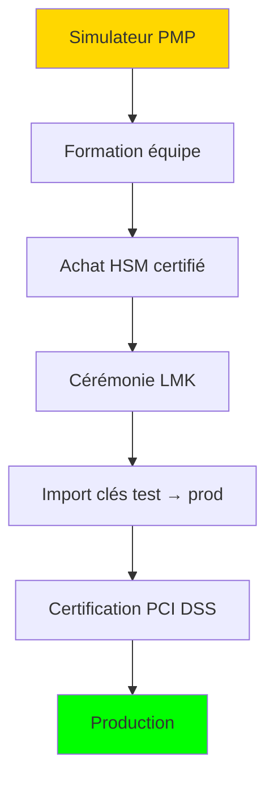

# 🔐 HSM Simulator vs Real HSM - Comparaison Pédagogique

> **Documentation comparative pour comprendre les différences entre le simulateur et un vrai HSM**

---

## 📊 Vue d'ensemble

| Aspect | HSM-Simulator | Vrai HSM (ex: Thales PayShield 10K) |
|--------|---------------|-------------------------------------|
| **Type** | Logiciel (100% software) | Matériel dédié (appliance) |
| **Certification** | Aucune (pédagogique) | FIPS 140-2 Level 3, PCI HSM |
| **Prix** | Gratuit | 30,000€ - 100,000€ |
| **Protection clés** | RAM standard | Mémoire protégée + tamper mesh |
| **Effacement** | Manuel | Automatique sur tamper |

---

## 🔒 Sécurité Physique

### Simulateur PMP
```
┌─────────────────────────────────────┐
│  💻 Processus Node.js standard      │
│                                     │
│  • Clés en RAM non protégée         │
│  • Accessible via debugger          │
│  • Pas de protection physique       │
│  • Logs en clair possible           │
└─────────────────────────────────────┘
```

### Vrai HSM
```
┌─────────────────────────────────────┐
│  🏦 Boîtier inviolable              │
│  ┌───────────────────────────────┐  │
│  │  Maillage de protection      │  │
│  │  ┌─────────────────────────┐ │  │
│  │  │  Processeur sécurisé   │ │  │
│  │  │  RAM volatile          │ │  │
│  │  │  Batterie backup       │ │  │
│  │  └─────────────────────────┘ │  │
│  │  Capteurs: T°, voltage,      │  │
│  │  lumière, mouvement          │  │
│  └───────────────────────────────┘  │
│  Tamper → Effacement instantané     │
└─────────────────────────────────────┘
```

---

## 🔑 Gestion des Clés

### Cycle de vie des clés

| Étape | Simulateur | Vrai HSM |
|-------|-----------|----------|
| **Génération** | `crypto.randomBytes()` | TRNG matériel certifié |
| **Stockage** | Map JavaScript en RAM | Mémoire sécurisée zéros |
| **Chiffrement** | Sous LMK logicielle | Sous LMK matérielle |
| **Export** | Buffer Node.js | Uniquement chiffrée |
| **Destruction** | `delete` / GC | Zeroization physique |

### Local Master Key (LMK)

**Simulateur:**
```typescript
// LMK stockée en mémoire standard
private lmk = Buffer.from('0123...', 'hex');
```

**Vrai HSM:**
- LMK générée lors de la cérémonie de clés
- Jamais exportable, même par l'administrateur
- Composants partagés entre plusieurs gardiens
- Backup physique sécurisé (smart cards)

---

## 📡 Protocole Thales

### Commandes implémentées

| Code | Commande | Simulateur | Vrai HSM |
|------|----------|-----------|----------|
| A0 | Generate Key | ✅ Simplifié | ✅ Complet + variantes |
| BU | Translate PIN | ✅ Basique | ✅ Toutes variantes |
| CA | Verify PIN | ✅ IBM Method | ✅ 5+ méthodes |
| CW | Generate CVV | ✅ | ✅ CVV/CVV2/iCVV |
| EC | Generate MAC | ✅ Retail MAC | ✅ 10+ algorithmes |
| NC | Diagnostic | ✅ Simplifié | ✅ 50+ paramètres |

### Différences de réponses

**Simulateur (simplifié):**
```
Request:  0000A0U
Response: 0000A1U[key_hex][kcv]
```

**Vrai HSM (complet):**
```
Request:  0000A0U;00;1
Response: 0000A1U00X[key_under_lmk][kcv][flags][variant]
```

---

## ⚡ Performance

| Métrique | Simulateur | Vrai HSM |
|----------|-----------|----------|
| PIN Block/sec | ~1,000 | ~10,000 |
| RSA Sign/sec | ~500 | ~5,000 |
| AES Encrypt/sec | ~10,000 | ~100,000 |
| Latence typique | 1-5ms | 0.1-0.5ms |
| Connexions simultanées | ~100 | ~1,000 |

---

## 🔐 Modes de Sécurité

### Simulateur - Mode Pédagogique
```
┌──────────────────────────────────┐
│  🎓 MODE PÉDAGOGIQUE             │
│                                  │
│  ✓ Logs détaillés visibles       │
│  ✓ Clés affichables en debug     │
│  ✓ Pas de rate limiting strict   │
│  ✓ Erreurs explicatives          │
│                                  │
│  ⚠️  NE JAMAIS UTILISER EN PROD   │
└──────────────────────────────────┘
```

### Vrai HSM - Mode Production
```
┌──────────────────────────────────┐
│  🔒 MODE PRODUCTION              │
│                                  │
│  ✗ Clés jamais visibles          │
│  ✗ Logs sans données sensibles   │
│  ✓ Rate limiting par client      │
│  ✓ Dual control obligatoire      │
│  ✓ Audit trail signé             │
│                                  │
│  ✓ Certifié pour production      │
└──────────────────────────────────┘
```

---

## 🧪 Certification PCI HSM

### Exigences non couvertes par le simulateur

| Exigence PCI HSM | Simulateur | Vrai HSM |
|------------------|-----------|----------|
| Tamper-evident enclosure | ❌ | ✅ |
| FIPS 140-2 Level 3 crypto | ❌ | ✅ |
| Dual control for key loading | ❌ | ✅ |
| Zeroization on tamper | ⚠️ Simulé | ✅ Physique |
| Audit trail integrity | ❌ | ✅ Signé |
| Key backup authentication | ❌ | ✅ Smart card |
| Environmental sensors | ⚠️ Simulé | ✅ Matériel |
| Random number generator | ⚠️ PRNG | ✅ TRNG |

---

## 📚 Standards Implémentés

### Comparaison de conformité

| Standard | Simulateur | Vrai HSM |
|----------|-----------|----------|
| **ISO 9564-1** (PIN Block) | Format 0, 1, 3 | Tous formats |
| **ISO 9797-1** (MAC) | Retail MAC | 6 méthodes |
| **ISO 11568** (Key Management) | Basique | Complet |
| **ANSI X9.24** (DUKPT) | Simplifié | TR-31 complet |
| **ANSI X9.8** (PIN) | Partiel | Complet |
| **EMV** | Non | Complet |

---

## 🎓 Ce que vous apprenez avec le simulateur

### Concepts maîtrisés ✅

1. **Structure des clés bancaires**
   - ZMK, ZPK, TPK, TMK, TAK, PVK, CVK
   - Hiérarchie et dérivation

2. **Opérations cryptographiques**
   - PIN Block génération et translation
   - MAC calculation et vérification
   - Chiffrement/déchiffrement

3. **Protocole Thales**
   - Structure commande/réponse
   - Codes d'erreur standards
   - Flow de transaction

4. **Sécurité pédagogique**
   - Pourquoi chaque protection existe
   - Conséquences des failles
   - Bonnes pratiques

### Ce qui nécessite un vrai HSM 🔒

1. **Certification production**
   - Manipulation de vraies cartes
   - Connexion aux réseaux de paiement
   - Traitement de transactions réelles

2. **Formation avancée**
   - Cérémonies de clés
   - Audit de conformité
   - Incident response

---

## 🔄 Migration vers Production

### Étapes pour passer du simulateur à un vrai HSM



### Checklist de migration

1. [ ] Formation HSM vendor (Thales/Utimaco)
2. [ ] Acquisition HSM + backup
3. [ ] Installation infrastructure sécurisée
4. [ ] Cérémonie de clés (min. 3 gardiens)
5. [ ] Configuration réseau séparé
6. [ ] Tests d'intégration
7. [ ] Audit de sécurité
8. [ ] Certification PCI DSS/PCI PIN
9. [ ] Go-live progressif

---

## 📖 Ressources complémentaires

### Documentation officielle
- [Thales PayShield Documentation](https://cpl.thalesgroup.com/encryption/hardware-security-modules)
- [PCI HSM Requirements](https://www.pcisecuritystandards.org/document_library)
- [FIPS 140-2 Standard](https://csrc.nist.gov/publications/detail/fips/140/2/final)

### Standards ISO
- ISO 9564-1:2017 - PIN security
- ISO 9797-1:2011 - MACs
- ISO 11568:2005 - Key management

### Formation
- Thales HSM Administrator Training
- PCI Professional (PCIP) Certification
- SANS SEC504 - Incident Handler

---

> **💡 Rappel:** Ce simulateur est un outil d'apprentissage. Les vrais HSM utilisent des composants matériels spécialisés impossibles à répliquer en logiciel. La certification PCI HSM exige des audits physiques et des tests de pénétration sur le matériel réel.
