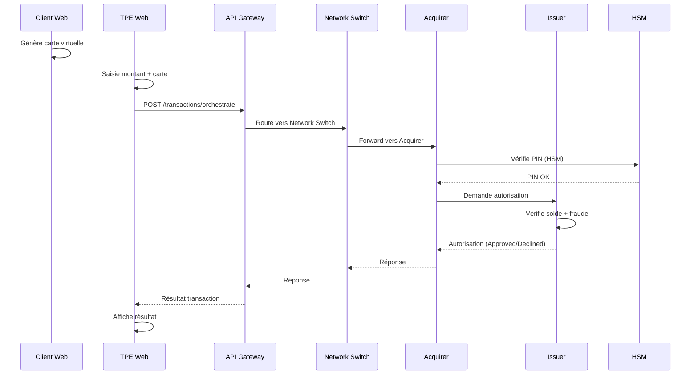

# 🔗 Guide de Connexion Frontend ↔ Backend

## Vue d'ensemble

Ce document explique comment connecter les différentes interfaces frontend aux services backend de la plateforme PMP.

---

## 🏗 Architecture des Ports

```
┌─────────────────────────────────────────────────────────────────────┐
│                         FRONTEND LAYER                               │
├─────────────────────────────────────────────────────────────────────┤
│  user-cards-web    │  tpe-web        │  hsm-web       │  mobile     │
│  :3000             │  :3001          │  :3002         │  :3002      │
└────────┬───────────┴────────┬────────┴───────┬────────┴──────┬──────┘
         │                    │                │               │
         ▼                    ▼                ▼               ▼
┌─────────────────────────────────────────────────────────────────────┐
│                         API GATEWAY (:8000)                          │
└────────┬────────────────────┬────────────────────────────────┬──────┘
         │                    │                                │
         ▼                    ▼                                ▼
┌─────────────────────────────────────────────────────────────────────┐
│                         BACKEND SERVICES                             │
├─────────────────────────────────────────────────────────────────────┤
│  sim-card      :8001    │  Gestion des cartes virtuelles            │
│  sim-pos       :8002    │  Terminal de paiement                     │
│  sim-acquirer  :8003    │  Banque acquéreur                         │
│  network-switch:8004    │  Routage réseau (orchestration)           │
│  sim-issuer    :8005    │  Banque émettrice                         │
│  auth-engine   :8006    │  Moteur d'autorisation                    │
│  fraud-detect  :8007    │  Détection de fraude                      │
│  crypto-service:8010    │  Services cryptographiques                │
│  hsm-simulator :8011    │  Simulateur HSM                           │
│  key-management:8012    │  Gestion des clés                         │
└─────────────────────────────────────────────────────────────────────┘
```

---

## 🔧 Configuration Requise

### 1. Fichier `.env` (racine du projet)

```bash
# URLs des services backend
CARD_SERVICE_URL=http://localhost:8001
POS_SERVICE_URL=http://localhost:8002
ACQUIRER_SERVICE_URL=http://localhost:8003
NETWORK_SWITCH_URL=http://localhost:8004
ISSUER_SERVICE_URL=http://localhost:8005
AUTH_ENGINE_URL=http://localhost:8006
FRAUD_DETECTION_URL=http://localhost:8007
CRYPTO_SERVICE_URL=http://localhost:8010
HSM_SIMULATOR_URL=http://localhost:8011
KEY_MANAGEMENT_URL=http://localhost:8012
```

### 2. Variables Frontend (Next.js)

Dans chaque app frontend (`user-cards-web`, `tpe-web`), créer `.env.local`:

```bash
# Frontend Environment Variables
NEXT_PUBLIC_API_URL=http://localhost:8000
```

---

## 📡 Points de Connexion par Application

### 1. TPE Web (Terminal de Paiement) → Network Switch

Le terminal de paiement envoie les transactions vers le service d'orchestration :

```typescript
// tpe-web/lib/api-client.ts
const API_BASE_URL = process.env.NEXT_PUBLIC_API_URL || 'http://localhost:8000';

export async function processTransaction(data: TransactionRequest) {
    const response = await axios.post(
        `${API_BASE_URL}/api/transactions/orchestrate`,
        data
    );
    return response.data;
}
```

**Flux de transaction :**
```
TPE Web → API Gateway (:8000) → Network Switch (:8004) → Acquirer → Issuer → Auth
```

---

### 2. User Cards Web → Card Service

L'interface client communique avec le service de cartes :

```typescript
// Créer: user-cards-web/lib/api-client.ts
const API_BASE_URL = process.env.NEXT_PUBLIC_API_URL || 'http://localhost:8000';

export async function getCards() {
    return axios.get(`${API_BASE_URL}/api/cards`);
}

export async function createCard(data: CardRequest) {
    return axios.post(`${API_BASE_URL}/api/cards`, data);
}

export async function getTransactions(cardId: string) {
    return axios.get(`${API_BASE_URL}/api/cards/${cardId}/transactions`);
}
```

---

### 3. HSM Web → HSM Simulator + Key Management

L'interface HSM communique avec les services de sécurité :

```typescript
// hsm-web/lib/api-client.ts
const HSM_URL = process.env.NEXT_PUBLIC_HSM_URL || 'http://localhost:8011';
const KEY_URL = process.env.NEXT_PUBLIC_KEY_URL || 'http://localhost:8012';

export async function getKeys() {
    return axios.get(`${KEY_URL}/api/keys`);
}

export async function getHsmStatus() {
    return axios.get(`${HSM_URL}/api/status`);
}

export async function setVulnerability(config: VulnConfig) {
    return axios.post(`${HSM_URL}/api/vulnerabilities`, config);
}
```

---

## 🚀 Démarrage Complet (Full Stack)

### Étape 1: Démarrer le Backend

```bash
# Option A: Avec Docker Compose (recommandé)
docker-compose up -d

# Option B: Services individuels (développement)
cd backend/sim-card-service && npm run dev &
cd backend/sim-pos-service && npm run dev &
cd backend/sim-acquirer-service && npm run dev &
cd backend/sim-network-switch && npm run dev &
cd backend/sim-issuer-service && npm run dev &
cd backend/sim-auth-engine && npm run dev &
cd backend/sim-fraud-detection && npm run dev &
cd backend/crypto-service && npm run dev &
cd backend/hsm-simulator && npm run dev &
cd backend/key-management && npm run dev &
cd backend/api-gateway && npm run dev &
```

### Étape 2: Vérifier les Services

```bash
# Tester que les services répondent
curl http://localhost:8001/health  # Card Service
curl http://localhost:8004/health  # Network Switch
curl http://localhost:8011/health  # HSM Simulator
```

### Étape 3: Démarrer le Frontend

```bash
# Terminal 1 - Client App
cd frontend/user-cards-web && npm run dev

# Terminal 2 - Merchant Terminal
cd frontend/tpe-web && npm run dev

# Terminal 3 - HSM Interface (optionnel)
cd frontend/hsm-web && npm run dev
```

---

## 🧪 Mode Simulation (Sans Backend)

Le terminal de paiement inclut un mode simulation pour tester sans backend :

```typescript
// tpe-web/lib/api-client.ts
const IS_SIMULATION = true; // Activer pour la démo

if (IS_SIMULATION) {
    // Retourne des réponses mockées
    return mockOrchestration(data);
}
```

**Pour désactiver la simulation** et utiliser le vrai backend :
1. Ouvrir `frontend/tpe-web/lib/api-client.ts`
2. Mettre `IS_SIMULATION = false`
3. S'assurer que le backend est démarré

---

## 📊 Diagramme de Séquence (Transaction Complète)



---

## ❌ Problèmes Courants

| Problème | Cause | Solution |
|----------|-------|----------|
| `ECONNREFUSED` | Backend non démarré | `docker-compose up -d` |
| `CORS error` | Frontend/Backend sur domaines différents | Vérifier config CORS dans API Gateway |
| `404 Not Found` | Mauvaise URL d'API | Vérifier `NEXT_PUBLIC_API_URL` |
| `Network Error` | Backend crash | Consulter logs: `docker-compose logs -f` |

---

## 📁 Fichiers Clés à Configurer

| Fichier | Objectif |
|---------|----------|
| `.env` | Variables globales (ports, credentials) |
| `frontend/tpe-web/.env.local` | URL API pour terminal |
| `frontend/user-cards-web/.env.local` | URL API pour client |
| `frontend/tpe-web/lib/api-client.ts` | Client HTTP + mode simulation |
| `docker-compose.yml` | Orchestration des services |

---

*Document créé automatiquement • Janvier 2026*
