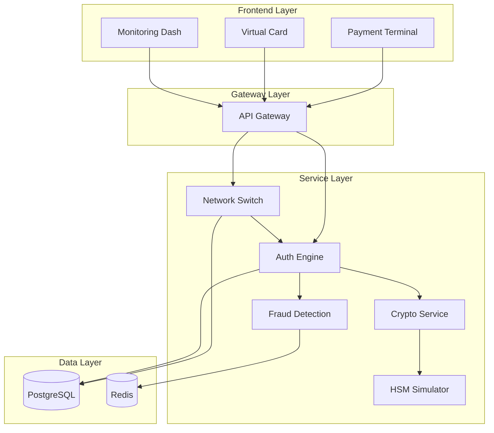
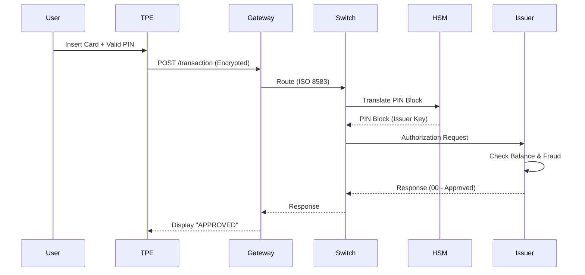
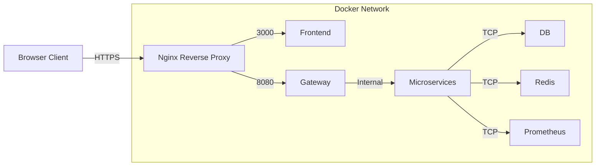

# Architecture Diagrams

## Component Diagram

```mermaid
graph TD
    subgraph "Frontend Layer"
        TPE[Payment Terminal]
        Card[Virtual Card]
        Dash[Monitoring Dash]
    end

    subgraph "Gateway Layer"
        API[API Gateway]
    end

    subgraph "Service Layer"
        Switch[Network Switch]
        Auth[Auth Engine]
        Fraud[Fraud Detection]
        Crypto[Crypto Service]
        HSM[HSM Simulator]
    end

    subgraph "Data Layer"
        DB[(PostgreSQL)]
        Redis[(Redis)]
    end

    TPE --> API
    Card --> API
    Dash --> API

    API --> Switch
    API --> Auth

    Switch --> Auth
    Switch --> DB
    
    Auth --> Fraud
    Auth --> Crypto
    
    Crypto --> HSM

    Auth --> DB
    Fraud --> Redis
```

## Transaction Sequence

```mermaid
sequenceDiagram
    participant User
    participant TPE
    participant Gateway
    participant Switch
    participant HSM
    participant Issuer

    User->>TPE: Insert Card + Valid PIN
    TPE->>Gateway: POST /transaction (Encrypted)
    Gateway->>Switch: Route (ISO 8583)
    Switch->>HSM: Translate PIN Block
    HSM-->>Switch: PIN Block (Issuer Key)
    Switch->>Issuer: Authorization Request
    Issuer->>Issuer: Check Balance & Fraud
    Issuer-->>Switch: Response (00 - Approved)
    Switch-->>Gateway: Response
    Gateway-->>TPE: Display "APPROVED"
```

## Deployment Diagram

```mermaid
graph LR
    Client[Browser Client] -- HTTPS --> Nginx[Nginx Reverse Proxy]
    
    subgraph "Docker Network"
        Nginx -- 3000 --> Frontend
        Nginx -- 8080 --> Gateway
        
        Gateway -- Internal --> Microservices
        
        Microservices -- TCP --> DB
        Microservices -- TCP --> Redis
        Microservices -- TCP --> Prometheus
    end
```
